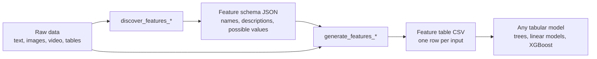

# LLM Feature Gen

`llm-feature-gen` turns unstructured data — text, images, video, and tabular files — into a small table of human-readable features, so you can train interpretable models where you would otherwise reach for embeddings.

One input becomes one row; one feature becomes one named column:

> "The service was slow and the food arrived cold."

| emotional tone | service speed | food temperature |
| --- | --- | --- |
| negative | slow | cold |

An LLM first proposes the feature schema from a sample of your data, then fills in values for every input. Both steps are plain function calls:

```python
from llm_feature_gen import discover_features_from_texts, generate_features_from_texts

discover_features_from_texts("discover_texts")
# writes outputs/discovered_text_features.json

generate_features_from_texts("texts", merge_to_single_csv=True)
# writes one CSV per class folder, plus outputs/all_feature_values.csv
```



Compared with embeddings, every column has a name a domain expert can read. Compared with zero-shot classification, the output is a reusable tabular dataset you can model, audit, and share — the schema is discovered once and can be pinned for all later runs.

You need an LLM provider: an OpenAI or Azure OpenAI key, or any local OpenAI-compatible server such as Ollama (no key required). Every call sends data to that provider and, for hosted APIs, consumes paid tokens.

Where to go next:

- [Quickstart](quickstart.md) — your first feature table in a few minutes.
- [Provider configuration](provider-configuration.md) — OpenAI, Azure OpenAI, or a local server.
- [Text-to-tabular pipeline](examples.md) — end-to-end example finishing in a downstream classifier.
- [When to use it](when-to-use.md) — how this compares to embeddings and zero-shot classification.
- [API reference](api/discover.md) — every public function.
