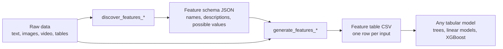

# LLM Feature Gen

`llm-feature-gen` converts unstructured data — text, images, video, and tabular files — into a compact table of interpretable features, so you can train transparent models where you would otherwise reach for embeddings.

A language model first proposes a feature schema from a sample of the corpus, then assigns values to every input. Each input becomes one row and each feature one named column:

| input | issue category | urgency | sentiment |
| --- | --- | --- | --- |
| "I was charged twice for a single order." | billing | medium | frustrated |
| "Login fails with a two-factor error." | access | high | frustrated |
| "Could you confirm my invoice was received?" | billing | low | neutral |

## Quickstart

For text, `LLMFeatureTransformer` is a standard scikit-learn transformer: it takes raw texts and returns a table of named features, so it can be placed in a `Pipeline` ahead of any estimator.

```bash
pip install "llm-feature-gen[sklearn]"
```

```python
from llm_feature_gen import LLMFeatureTransformer
from sklearn.linear_model import LogisticRegression
from sklearn.pipeline import make_pipeline
from sklearn.preprocessing import OneHotEncoder

model = make_pipeline(
    LLMFeatureTransformer(),
    OneHotEncoder(handle_unknown="ignore"),
    LogisticRegression(),
).fit(texts, labels)

model.predict(["My card was billed the wrong amount."])
```

The `sklearn` extra pulls in scikit-learn itself, which this pipeline composes with. The transformer alone runs on a plain `pip install llm-feature-gen`.

`fit` asks an LLM which features distinguish your texts, then fills them in for every sample. Nothing downstream needs to know an LLM was involved — and unlike an embedding, you can print the intermediate table and read it:

```python
LLMFeatureTransformer().fit_transform(texts)
```

That call returns the table at the top of this page as a pandas DataFrame — the same representation the classifier is trained on, available for inspection at any point in the pipeline.

[Full quickstart →](quickstart.md)

## How it works

Under the transformer are two plain function calls, which you can also use on their own to produce CSV and JSON files:

```python
from llm_feature_gen import discover_features_from_texts, generate_features_from_texts

discover_features_from_texts("discover_texts")
# writes outputs/discovered_text_features.json

generate_features_from_texts("texts", merge_to_single_csv=True)
# writes one CSV per class folder, plus outputs/all_feature_values.csv
```



The schema is discovered once and can be pinned for all later runs. Compared with embeddings, every column has a name a domain expert can read. Compared with zero-shot classification, the output is a reusable tabular dataset you can model, audit, and share.

## What you need

An LLM provider: an OpenAI or Azure OpenAI key, or any local OpenAI-compatible server such as Ollama (no key required). Every call sends data to that provider and, for hosted APIs, consumes paid tokens.

The scikit-learn transformer covers text. Images, video, and tabular files use the two-step workflow above and produce the same kind of feature table.

## Where to go next

- [Quickstart](quickstart.md) — your first feature table in a few minutes.
- [Provider configuration](provider-configuration.md) — OpenAI, Azure OpenAI, or a local server.
- [Text-to-tabular pipeline](examples.md) — end-to-end example finishing in a downstream classifier.
- [When to use it](when-to-use.md) — how this compares to embeddings and zero-shot classification.
- [API reference](api/discover.md) — every public function.
